# Dasshine Label 界面操作指南

本文档按真实界面截图，说明平台从登录到标注、审核的完整操作路径。截图采集于本地开发环境（前端 `http://127.0.0.1:5173`，后端 `http://127.0.0.1:8000`）。

---

## 目录

1. [快速开始](#1-快速开始)
2. [登录与注册](#2-登录与注册)
3. [工作台](#3-工作台)
4. [项目管理](#4-项目管理)
5. [任务列表](#5-任务列表)
6. [审核工作台](#6-审核工作台)
7. [排行榜](#7-排行榜)
8. [用户管理](#8-用户管理)
9. [账户设置](#9-账户设置)
10. [标注工作台](#10-标注工作台)
11. [推荐操作流程](#11-推荐操作流程)
12. [默认账号与注意事项](#12-默认账号与注意事项)

---

## 1. 快速开始

| 步骤 | 操作 |
|------|------|
| 1 | 启动后端（默认 `:8000`），并执行 `cd backend && alembic upgrade head` |
| 2 | 启动前端：`cd frontend && npm run dev`（默认代理 `/api` → `:8000`） |
| 3 | 浏览器打开登录页，使用下方默认账号登录 |
| 4 | 在「项目管理」新建项目并导入数据，或通过工作台「演示入口」体验样例任务 |

初始化默认账号（`python scripts/init_db.py`，库为空时才会写入）：

| 用户名 | 密码 | 角色 |
|--------|------|------|
| `admin` | `admin123` | 管理员 |
| `annotator` | `anno123` | 标注员 |
| `reviewer` | `review123` | 审核员 |

---

## 2. 登录与注册

### 2.1 登录页 `/login`

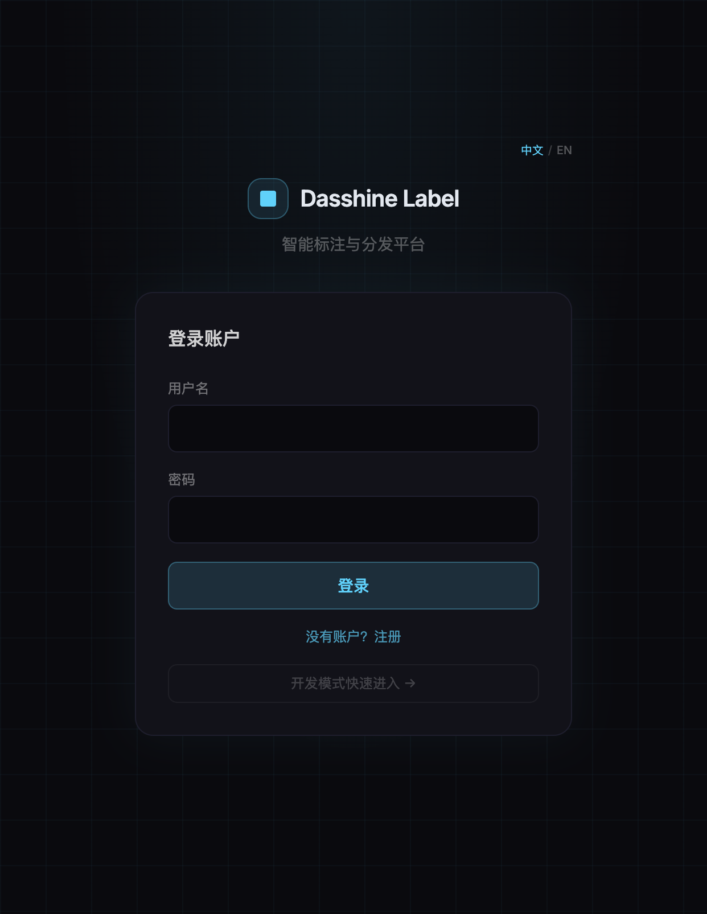

界面说明：

- 顶部品牌 **Dasshine Label** 与标语「智能标注与分发平台」
- 右上角 **中文 / EN** 语言切换
- 输入 **用户名**（也可用邮箱）与 **密码** 后点击 **登录**
- **没有账户？注册** 跳转到注册页
- 开发环境下可见 **开发模式快速进入**（仅本地假登录，不走后端）

常见问题：

- 若登录 500 且日志出现 `column users.oidc_sub does not exist`，说明数据库迁移未跑完，请执行 `alembic upgrade head`
- Redis 未启动时会出现限流回退到内存的 WARNING，一般不影响登录

### 2.2 注册页 `/register`

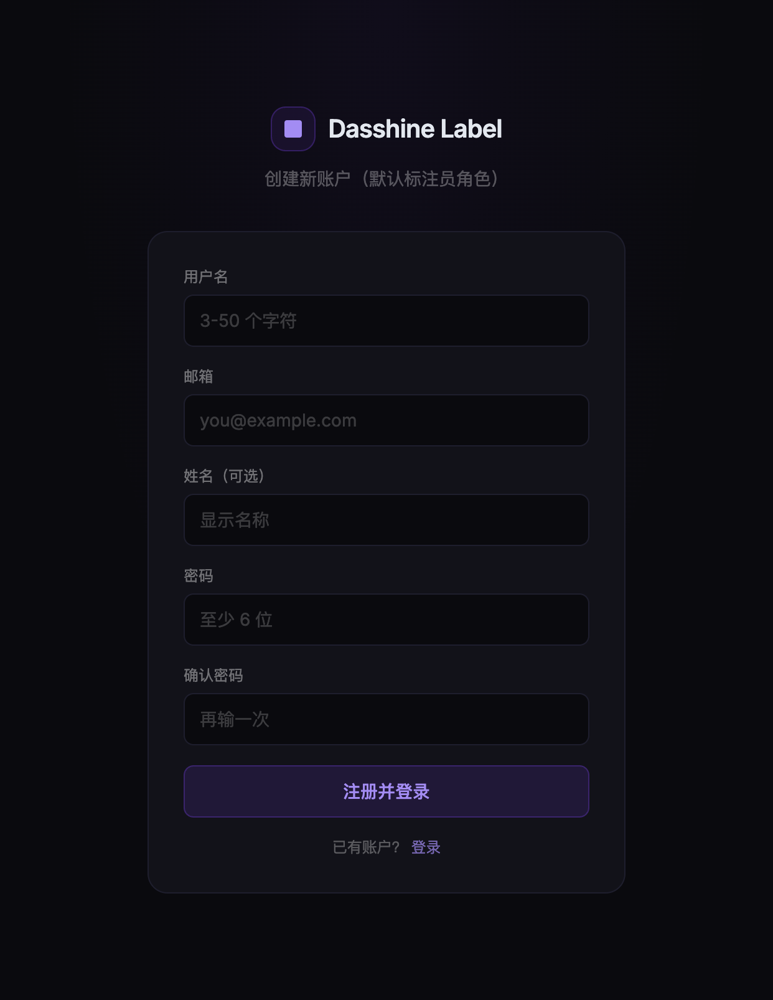

- 默认角色为 **标注员**
- 字段：用户名（3–50）、邮箱、姓名（可选）、密码（≥6）、确认密码
- 成功后自动登录并进入工作台

---

## 3. 工作台

路径：`/`（登录后首页）

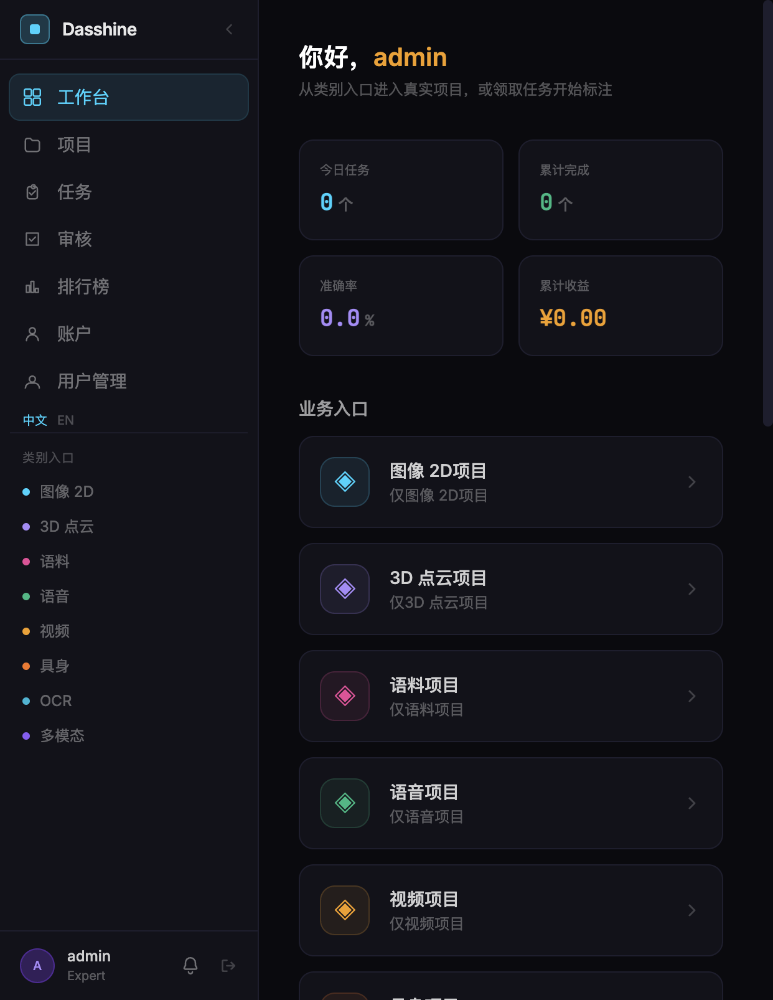

### 左侧导航

| 菜单 | 路径 | 说明 |
|------|------|------|
| 工作台 | `/` | 统计与入口总览 |
| 项目 | `/projects` | 项目列表与创建 |
| 任务 | `/tasks` | 领取 / 继续任务 |
| 审核 | `/review` | 已提交任务质检 |
| 排行榜 | `/leaderboard` | 质量分排序 |
| 账户 | `/profile` | 个人信息与改密 |
| 用户管理 | `/users` | 管理员可见 |

侧栏下部 **类别入口**（图像 2D、3D 点云、语料、语音、视频、具身、OCR、多模态）会带上 `?category=` 进入对应项目/任务筛选。

### 主区内容

- 问候语与个人统计：今日任务、累计完成、准确率、累计收益
- **业务入口**：进入真实项目（按模态过滤）或任务 / 审核
- **演示入口**（开发模式或 `VITE_ENABLE_DEMO_ENTRIES=true`）：硬编码样例 task，便于无数据时体验工作台

底部显示当前用户（截图中为 `admin` / Expert）、通知铃与退出。

---

## 4. 项目管理

路径：`/projects`

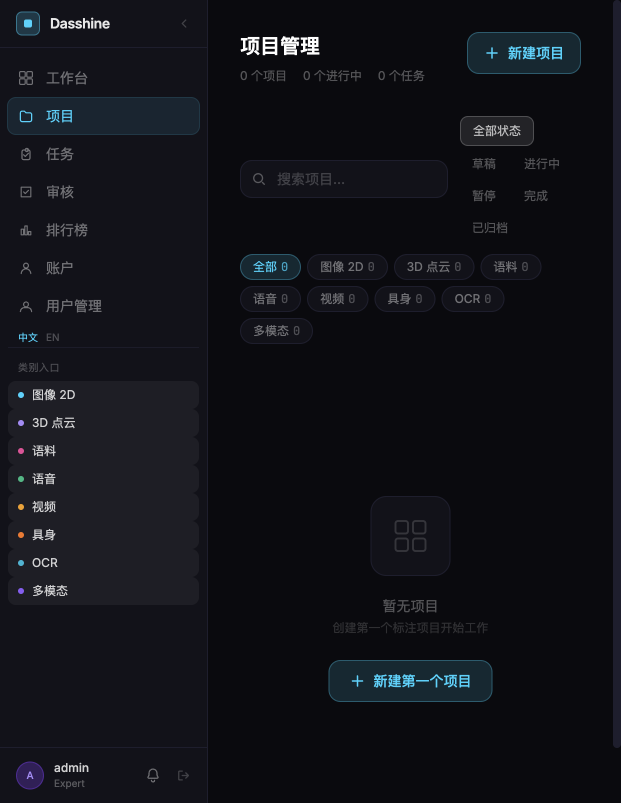

功能要点：

- 顶部统计：项目数、进行中数、任务数
- **搜索** + **状态筛选**（草稿 / 进行中 / 暂停 / 完成 / 已归档）
- **类别标签** 与侧栏类别入口同源
- 空态时引导 **新建第一个项目**

### 新建项目向导

点击 **+ 新建项目** 打开四步向导，第 1 步选择数据类型：

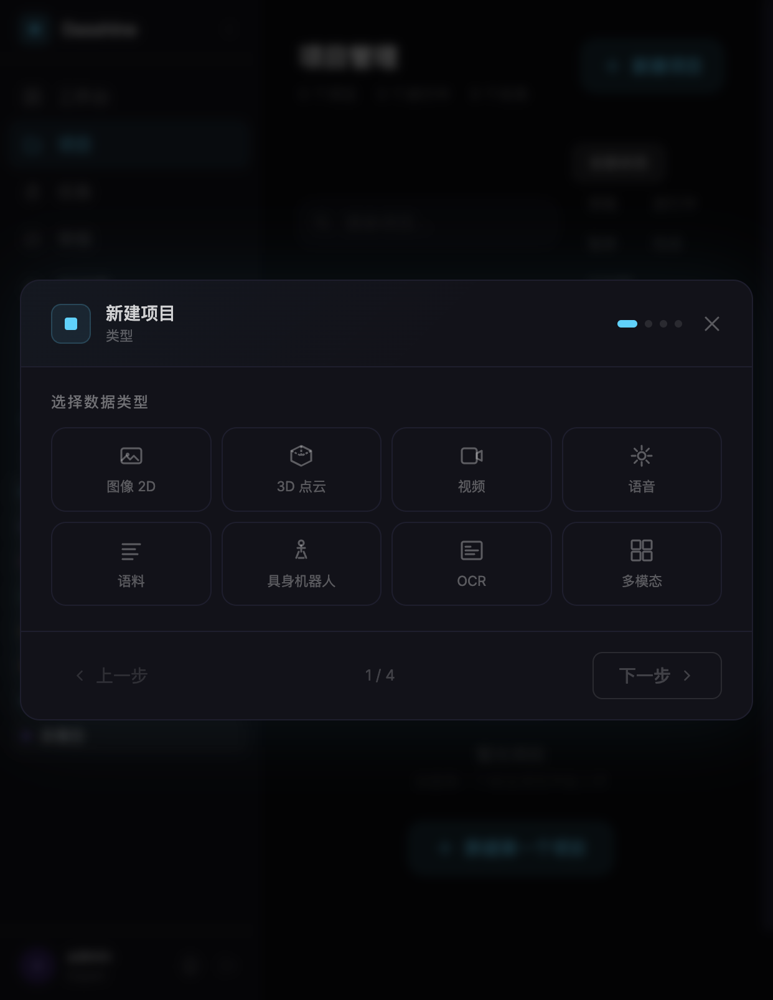

可选类型：图像 2D、3D 点云、视频、语音、语料、具身机器人、OCR、多模态。后续步骤配置名称、标签、导入方式（本地文件 / ZIP / YOLO / 存储前缀 / 组织挂载等）。

创建完成后进入项目任务页：`/projects/:projectId/tasks`，可网格预览任务并点进对应标注工作台。

---

## 5. 任务列表

路径：`/tasks`

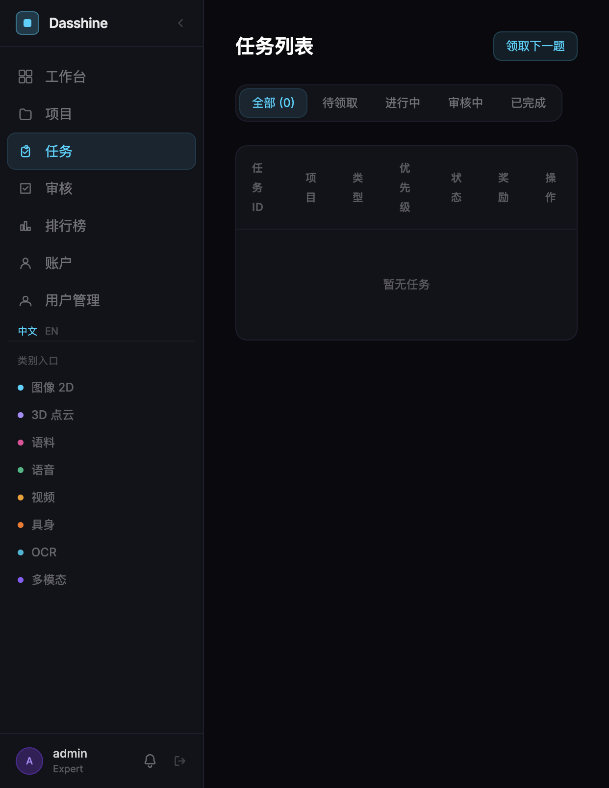

- **领取下一题**：按分发策略领取可做任务
- Tab：全部 / 待领取 / 进行中 / 审核中 / 已完成
- 表格列：任务 ID、项目、类型、优先级、状态、奖励、操作
- 可配合 `?category=` 收窄某一模态

---

## 6. 审核工作台

路径：`/review`

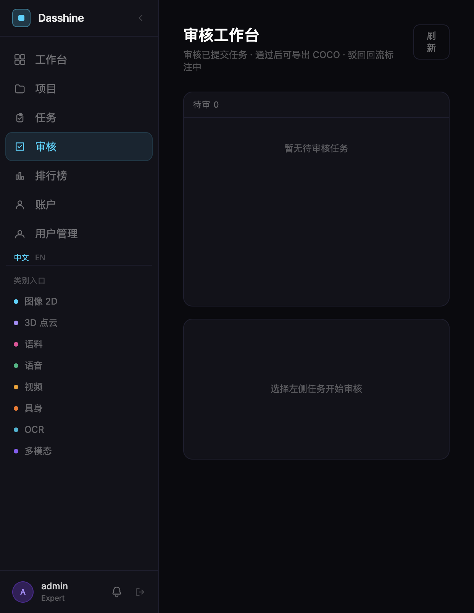

- 左侧（或上方面板）列出 **待审** 任务
- 选中后查看标注版本，执行 **通过** / **驳回**
- 通过后可用于导出（例如 COCO 等，见 `docs/export_formats.md`）
- 驳回后任务回流 **标注中**，标注员可修改再提交

---

## 7. 排行榜

路径：`/leaderboard`

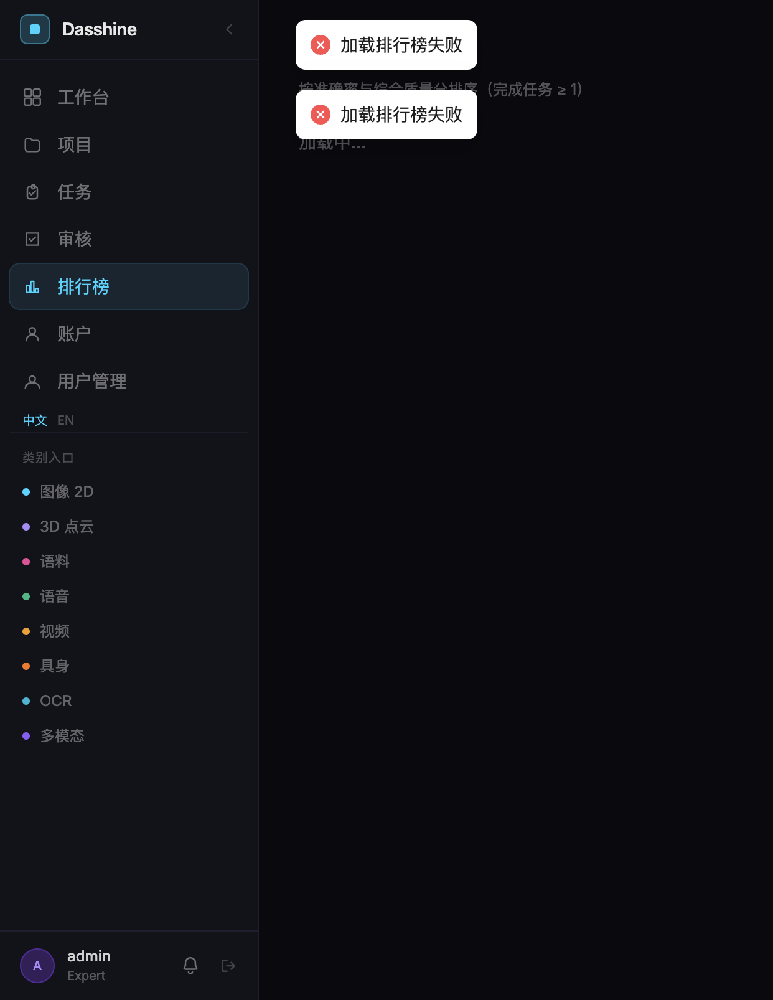

按准确率与综合质量分排序（通常要求完成任务数 ≥ 1）。无数据或接口异常时会显示加载失败提示。

---

## 8. 用户管理

路径：`/users`（管理员）

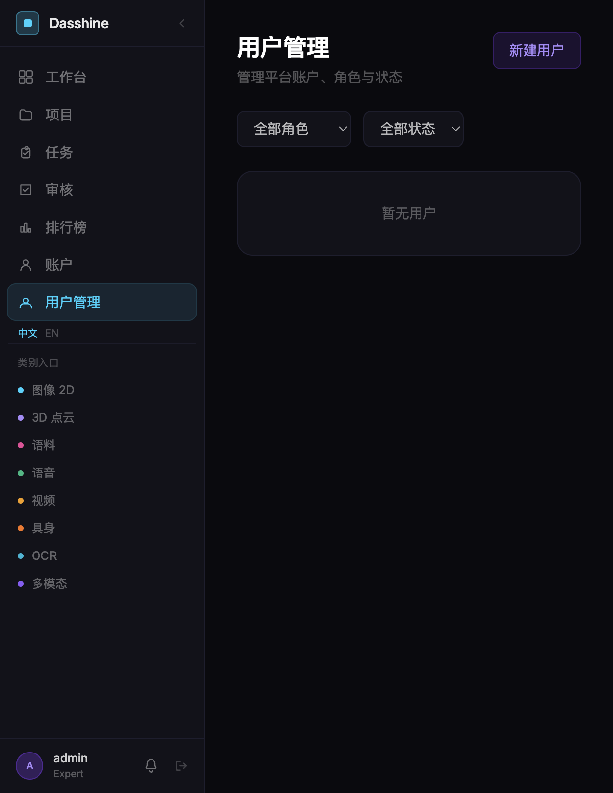

- **新建用户**、按角色 / 状态筛选
- 可调整角色（超级管理员 / 管理员 / 项目经理 / 标注员 / 审核员）与账户状态
- 非管理员账号侧栏通常不显示此入口

---

## 9. 账户设置

路径：`/profile`

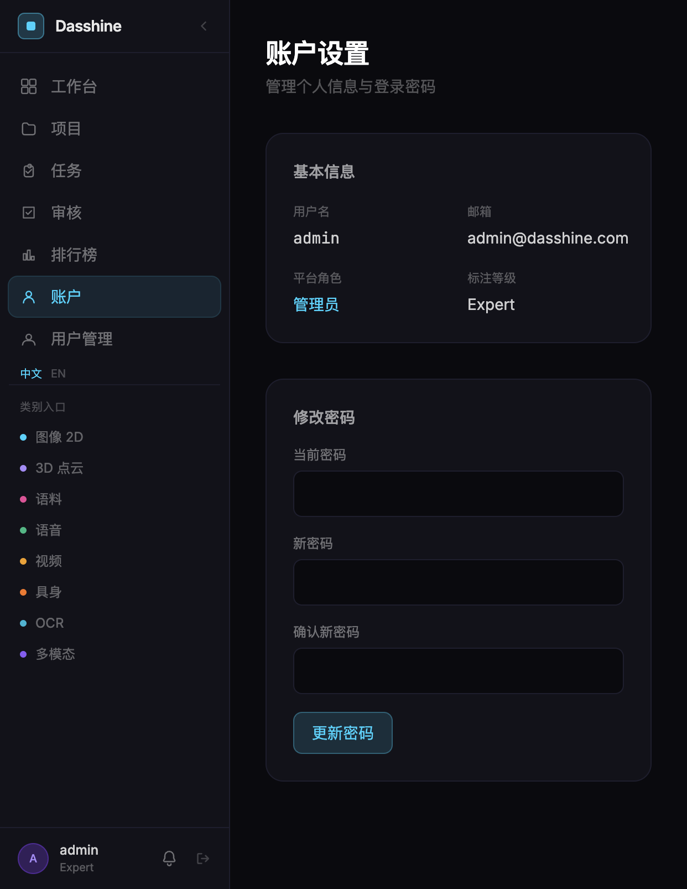

- **基本信息**：用户名、邮箱、平台角色、标注等级（只读展示为主）
- **修改密码**：当前密码 + 新密码 + 确认

---

## 10. 标注工作台

业务路径通常为：项目任务页 → 对应 `/annotate-* /:taskId`。  
开发环境也可从工作台 **演示入口** 进入样例。

### 10.1 图像 2D `/annotate-image/:taskId`

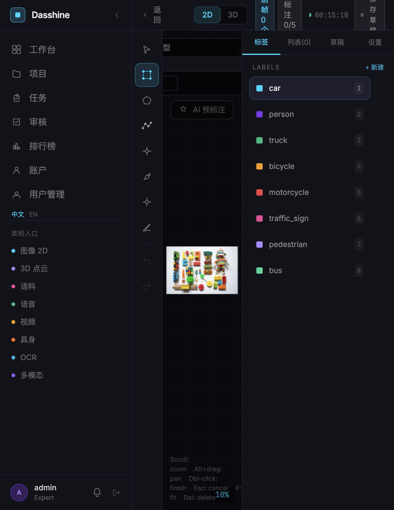

- 顶部：返回、2D/3D 切换、帧进度、计时、**保存草稿**、导出、提交
- 左侧工具：选择、矩形框、多边形、折线、关键点、画笔、橡皮等
- 画布：缩放 / 平移（见底部快捷键提示）
- 右侧：**标签 / 列表 / 草稿 / 设置**；支持 AI 预标注
- 演示样例：`task #1001`

### 10.2 3D 点云 `/annotate-3d/:taskId`

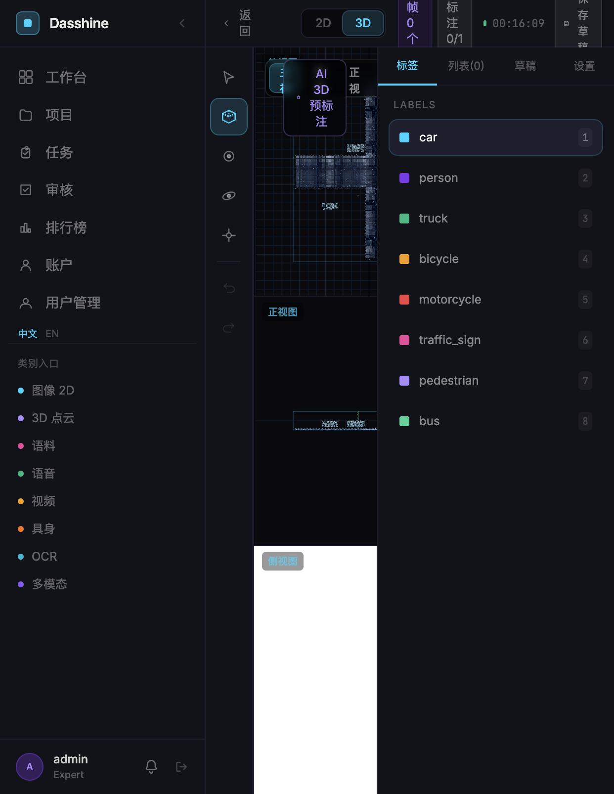

- 主视口 + 俯视 / 正视 / 侧视辅助视图
- 3D 框等工具，标签体系与 2D 类似
- 支持 **AI 3D 预标注**
- 演示样例：`task #1002`

### 10.3 语料 NER `/annotate-text/:taskId`

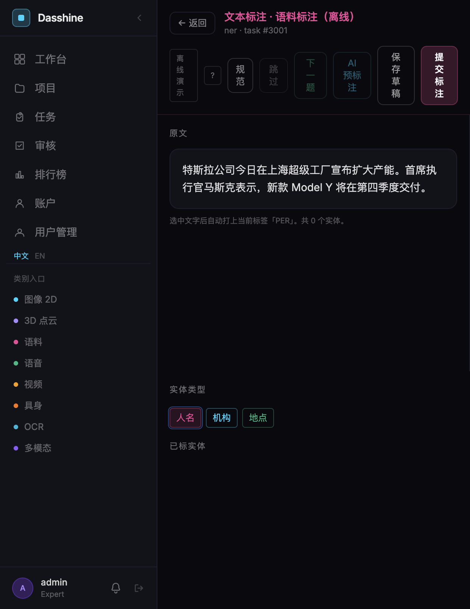

- 原文区选中文字，自动打上当前实体类型（人名 / 机构 / 地点等）
- 操作：保存草稿、提交标注；可选 AI 预标注（需配置服务）
- 演示样例：`task #3001`

### 10.4 具身机器人 `/annotate-embodied/:taskId`

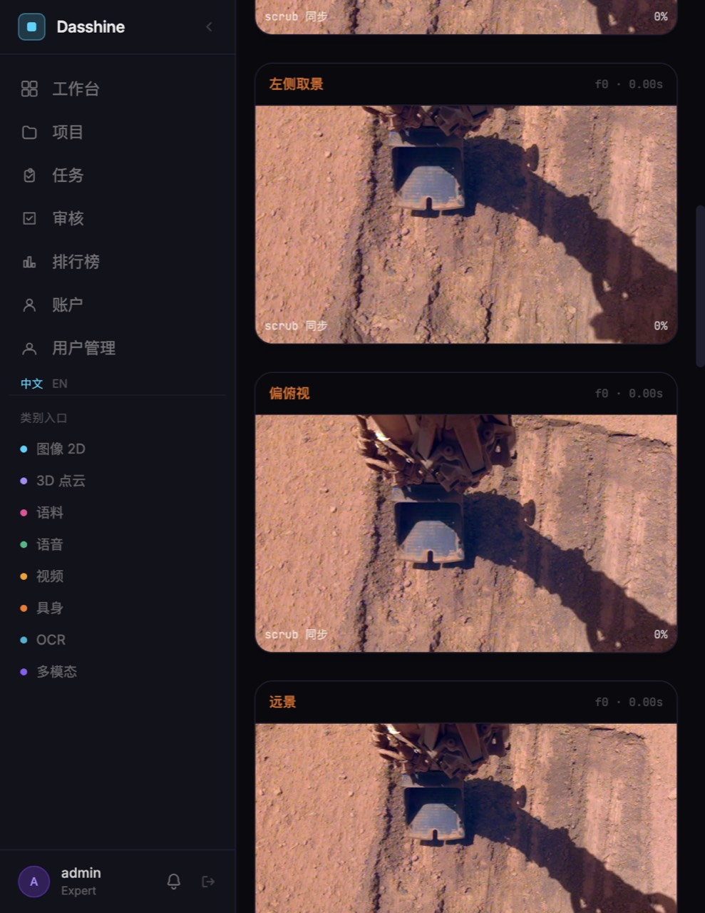

- 多机位视频同步 scrub
- 语言指令（VLA）、执行结果、抓取点 / EE 轨迹、动作词表、逐帧动作与备注
- 支持保存草稿、逐帧 / 连续播放、导出 JSON / 扭矩 CSV、提交审核
- 演示样例：InSight demo（多视角）

### 其他模态（路径一览）

| 模态 | 路径 |
|------|------|
| OCR | `/annotate-ocr/:taskId` |
| 语音 | `/annotate-audio/:taskId` |
| 视频 | `/annotate-video/:taskId` |
| 多模态 | `/annotate-multimodal/:taskId` |
| 兼容跳转 | `/annotate/:taskId`（按任务类型重定向） |

多人同时打开同一任务时，可能出现占用锁提示与 Automerge 共编 / 在线 presence（详见 `docs/p8_tenancy_collab.md`、`docs/p14_automerge_fuse_connect.md`）。

---

## 11. 推荐操作流程

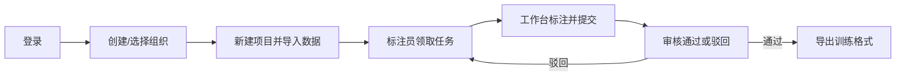
```mermaid
flowchart LR
  A[登录] --> B[创建/选择组织]
  B --> C[新建项目并导入数据]
  C --> D[标注员领取任务]
  D --> E[工作台标注并提交]
  E --> F[审核通过或驳回]
  F -->|驳回| D
  F -->|通过| G[导出训练格式]
```

1. **管理员**：注册/初始化账号 → 建组织 → 建项目 → 导入数据 → 邀请成员  
2. **标注员**：工作台或任务页领取 → 标注 → 保存草稿 → 提交  
3. **审核员**：审核工作台通过 / 驳回  
4. **导出**：项目任务页导出（按模态三种主流格式，见 `docs/export_formats.md`）；P19 起可做导出快照版本管理

---

## 12. 默认账号与注意事项

### 默认账号

见本文 [§1 快速开始](#1-快速开始)。

### 截图与演示数据说明

- 截图中部分列表为空（无项目 / 无任务），属于干净库的正常空态；演示入口仍可打开样例工作台。
- 演示 task ID（如 1001、1002、3001、`demo`）仅在开发或显式开启演示开关时出现，生产环境请走真实项目任务。
- 侧栏组织切换控制多租户隔离；请确认当前 `active_org` 再创建项目。

### 相关文档

| 文档 | 内容 |
|------|------|
| [README.md](../../README.md) | 产品总览与启动 |
| [docs/frontend.md](../frontend.md) | 前端结构补充说明 |
| [docs/export_formats.md](../export_formats.md) | 导出格式 |
| [docs/p19_dataset_analytics.md](../p19_dataset_analytics.md) | 数据集快照与分析 |
| [docs/p20_scale_hardening.md](../p20_scale_hardening.md) | 规模与硬化 |
| [docs/CANONICAL.md](../CANONICAL.md) | 仓库约定 |

### 重新截图

仓库内脚本（需 Playwright 浏览器已安装）：

```bash
# 前端 :5173、后端 :8000 已启动后
cd frontend
node ../scripts/capture_user_guide_screenshots.mjs
```

也可在 Cursor 浏览器中手动打开各页面截图，保存到 `docs/user-guide/images/`。

---

*文档版本：与 `develop` 分支界面一致 · 截图日期 2026-08-21*
